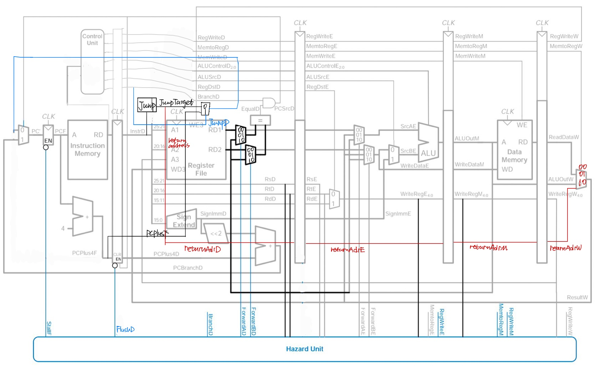

# Project 3 Report
*MIPS 5 Stage Pipeline CPU: **Full hazards solved** with forwarding & stalling.*


## 0. How to Run
* #### File Tree:

All the codes are in the src file.
```
+-- report.pdf
+-- src
|   +-- CPU.v, test_CPU.v, PCReg.v, IFID.v, IDEX.v, EXMEM.v, MEMWB.v, controlUnit.v, ALU.v, hazard_unit.v......
```
* #### Run with makefile:

**(1)**. Put the test instruction in "**instructions.bin**" under "**src**" file. **(2)**. **Compile** the Verilog files, **run** the test bench, and **compare** to the correct version:

```shell
cd ./src
make test
diff result.txt correct_answer.txt
```
The results in "**result.txt**", are all the data (512) in **MainMemory** after CPU running.


## 1. Big Picture
### 1.0 Overall Structure of 5-Stage Pipeline CPU
&nbsp;&nbsp;&nbsp;&nbsp;&nbsp;&nbsp;&nbsp;&nbsp;The purpose of pipeline CPU is to **increase the overall throughput**. It is implemented by enabling a certain number of instructions to run concurrently, since each of them utilizes different part of the CPU. In this project, the 5-stage pipeline CPU is implemented, meaning that the CPU is **split into 5 parts** where each part handle a specific function, and **at most 5 instructions** can **run concurrently**:
* ```IF```:  Fetch instructions.
* ```ID```:  Decode instructions.
* ```EX```:  Execution in ALU.
* ```MEM```: Main Memory Access or Write (Load or store).
* ```WB```:  Write back the results.

&nbsp;&nbsp;&nbsp;&nbsp;&nbsp;&nbsp;&nbsp;&nbsp;The 5 parts of CPU are isolated by **adding buffers to the single cycle data path**, which are triggered by a common clock **CLK** between them: ```IF/ID```, ```ID/EX```, ```EX/MEM```, and ```MEM/WB```. They ensure the data **updated synchronously** by the edge of clock.

### 1.1 Functions of Each Stage
&nbsp;&nbsp;&nbsp;&nbsp;&nbsp;&nbsp;&nbsp;&nbsp;Each of the five stage realizes many functions. 
* ```IF``` The main function is to **fetch instruction** from the instruction memory. The current PC value is added to **PC+4**. In my implementation, the **control unit** is moved to this stage, meaning that the CPU decode the fetched instruction and generate the control signals one stage earlier.
* ```ID``` The main function is to **fetch data from the register file** according to the **decoded information** from the 1st stage. **Jump and branch** decisions are also verified in this stage. **Sign-extension** of the immediate numbers also happens here.
* ```EX``` The main function is the **ALU** running. ALU provides a 32-bit result according to the control signals and two 32-bit operands.
* ```MEM``` The main function is to **read data** from the main memory to register (lw) and **store data** from register to main memory (sw) according to the control signals.
* ```WB``` The main function is to **write the results** gained from ALU or main memory back to the register file.

### 1.2 Possible Hazards

* #### Structural hazard: 
&nbsp;&nbsp;&nbsp;&nbsp;&nbsp;&nbsp;&nbsp;&nbsp;CPU attempts to **use the same resource in two different ways** (read and write) at the same time. It occurs in the memory and register file. 
&nbsp;&nbsp;&nbsp;&nbsp;&nbsp;&nbsp;&nbsp; ***(1)*** It may access memory to fetch instruction and data at the same time. So it separates instruction and data memory. 
&nbsp;&nbsp;&nbsp;&nbsp;&nbsp;&nbsp;&nbsp; ***(2)*** Read (ID) and write (WB) in registers may happen at the same times in pipeline. So it needs to separate read and write in register file. Noticing that the data in register should be updated before use, it should take write operation before read operation. So at the rising edge of the CLK, the CPU writes data to the register. At the falling edge of the CLK, the CPU reads data from the register.

* #### Data hazard: 
&nbsp;&nbsp;&nbsp;&nbsp;&nbsp;&nbsp;&nbsp;&nbsp;CPU attempts to **use item before ready** (inundated). It occurs under **4** situations. 
&nbsp;&nbsp;&nbsp;&nbsp;&nbsp;&nbsp;&nbsp; ***(1)*** Results of **EX** stage are used in **EX** stage in next CLK cycle: forward the results to be operands of ALU in the next CLK cycle. 
&nbsp;&nbsp;&nbsp;&nbsp;&nbsp;&nbsp;&nbsp; ***(2)*** Results of **MEM** stage are used in **EX** stage in next CLK cycle: stall one CLK cycle and then forward the results to ALU operands in the next cycle. 
&nbsp;&nbsp;&nbsp;&nbsp;&nbsp;&nbsp;&nbsp; ***(3)*** Results of **EX** stage are used in **ID** stage in next CLK cycle. The results from ALU serve as the condition to make Jr/Branch decision. The solution is to stall one CLK cycle. 
&nbsp;&nbsp;&nbsp;&nbsp;&nbsp;&nbsp;&nbsp; ***(4)*** Results of **MEM** stage are used in **ID** stage in next CLK cycle. The results from main memory serve as the condition to make Jr/Branch decision. The solution is to stall one CLK cycle. The solution is to stall two CLK cycles. 

* #### Control hazard:
&nbsp;&nbsp;&nbsp;&nbsp;&nbsp;&nbsp;&nbsp;&nbsp;CPU attempts to **make decision before condition is evaluated**. It occurs under **2** situations.
&nbsp;&nbsp;&nbsp;&nbsp;&nbsp;&nbsp;&nbsp; ***(1)*** CPU decides to **JUMP** while other instructions are in pipeline. The solution is to take the **assumption of** ***Not Jump*** and decide whether to jump at the **ID** stage. If assumption is wrong, CPU only need to **flush 1 instruction**.
&nbsp;&nbsp;&nbsp;&nbsp;&nbsp;&nbsp;&nbsp; ***(2)*** CPU decides to **BRANCH** while other instructions are in pipeline. The solution is to take the **assumption of** ***Not Branch*** and decide whether to branch at the **ID** stage. If assumption is wrong, CPU only need to **flush 1 instruction**.

## 2. Data Path


The data path in *tutorial 11* is modified in this implementation. In my implementation, the ```control unit``` was placed at the **IF** stage, which simplifies the hazard solving. Units for **Jump** instructions were added, such as the target address calculation and one multiplexer for sources of PC. As for **jal** instruction, the *return address* will be passed to the **WB** stage as an alternative for **ResultW**. **StallF**, **FlushD**, **ForwardAD**, **ForwardBD**, **ForwardAE** and **ForwardBE** are used to solve hazards.

## 3. Implementation Ideas
​		*Object-oriented* programming style and *bottom-up* method are used. Small modules are implemented firstly to assemble the whole CPU in ***CPU.v***.

### 3.0 Modules and Functions
&nbsp;&nbsp;&nbsp;&nbsp;&nbsp;&nbsp;&nbsp;&nbsp;The following shows all the units implemented with their names in *src* codes and their functions.
* **Buffer Registers**: ```PCReg```,```IFID```,```IDEX```, ```EXMEM``` and ```MEMWB``` in the *files with the same names*.
* **Memory**: ```MainMemory``` ,```InstructionRAM```, ```regFile``` in the *files with the same names*.
* **ALU module**```ALU``` in *ALU.v*.
* **Control module**: ```controlUnit``` in *controlUnit.v*.
* **Jump module**: ```JumpUnit``` in *JumpUnit.v*.
* **Hazard detection module**: ```hazardUnit``` in *hazard_unit.v*.
* **Other utilities modules**: 32-bit adder and sign extender in *adder32.v* and *signExtender.v*.
 #### 3.0.0 Buffer Registers module
 &nbsp;&nbsp;&nbsp;&nbsp;&nbsp;&nbsp;&nbsp;Triggered by the rising edge of **CLK**, passing inputs to the outputs using non-blocking assignment. **StallF** is the **lock** signal for ```PCReg``` register, making all its output unchanged at the next rising edge. **FlushD** is the **clear** signal for ```IFID``` register, making all its output into 0 at the next rising edge.
 #### 3.0.1 Memory module
​	```MainMemory``` contains 512 32-bit word as data. ```regFile``` is the register file and contains 32 32-bit registers for MIPS ISA. It writes at *posedge clk* and reads at *negedge clk*. The codes initialize all the data in ```MainMemory``` and ```regFile``` as 0 at the beginning of running. ```InstructionRAM``` read and store instructions from a *txt* file. The instructions can be fetch by **PC**. 

 #### 3.0.2 Control module
​		```controlUnit``` takes ***opcode*** and ***funct*** at **IF** stage as **input**. The **additional** *outputs* (compare to the tutorial 11 data) are the following:

 ```JumpF```: **1** if it needs to **jump** for the next stage (j, jal, jr).

```JumpRegF ```: **1** if it is ***jump Register*** instruction (jr).

```ALUControlF```: 4-bit values to determine the **operation in ALU** for the current instruction.

```RegDstF```: **1** if **Rd** as destination; **0** if **Rt** as destination.

```RSDpdF```: **1** if the result depends on the values of **Rs**.

```RTDpdF```: **1** if if the result depends on the values of **Rt**.


#### 3.0.3 Jump Unit
​		The inputs are the **[25:0] of 32-bit instruction**, **PC+4**, register **Rs** value, and control signal **Jump** at **ID** stage. It outputs the **return address** as **PC+4** and the jump **target address**.
#### 3.0.4 Hazard detection module
​		***Structural hazard*** is solved by separation of memory unit (register, instruction and data memory). The module deals with ***data hazard*** and ***control hazard***. Shown below is the solution of them.

##### (0). Output Signals

```forwardA(B)D```: **00** no forwarding; **01** forward result from **WB**; **10** forward *ALU* result from **MEM** stage (at **ID** stage). For SrcA(B).

```forwardA(B)E```: **00** no forwarding; **01** forward result from **WB**; **10** forward *ALU* result from **MEM** stage (at **EX** stage). For SrcA(B).

```StallF```: if **1**, stall the data in ```PCReg```.

```FlushD```: if **1**, flush the data in ```IDIF``` register.

##### (1). Forwarding Logic

*Only show the logic for **SrcA**. For SrcB, the logic is similar.*

* **EX --> EX**:

  > add $v0, $v1, $v2     --->     add $v3, $v0, $v1

  If RegWriteM & (WriteRegM != 0) & (WriteRegM == RsE) --> forward *ALU* result at **MEM** to **EX** stage, ```forwardAE``` = **10**

* **MEM --> EX**:

  > lw $v0, 16($v1)   --->   add $v1, $v0, $v2

  If RegWriteW & (not **EX --> EX**) & (WriteRegW != 0) & (WriteRegW=RsE) -> forward result at **WB** to **EX** stage, ```forwardAE``` = **01**

* **EX --> ID**:

  > add $v2, $v1, $v0   --->   beq $v2, $v4, 16

  If RegWriteM & (WriteRegM != 0) & (WriteRegM == RsD) --> forward *ALU* result at **MEM** to **ID** stage, ```forwardAE``` = **10**

* **MEM --> ID**:

  > lw $v0, 16($v1)   --->   jr $v0

  If RegWriteM & (not **EX --> ID**) & (WriteRegM != 0) & (WriteRegM == RsD) --> forward result at **WB** to **ID** stage, ```forwardAE``` = **01**

##### (2). Stall and Flush Logic

* **Load word --> ALU use**:	**StallF** and **FlushD** for 1 CLK cycle.

* **Load word --> jr / branch**:    **StallF** and **FlushD** for 2 CLK cycle.

* **EX --> jr / branch**:    **StallF** and **FlushD** for 1 CLK cycle.
* **j, jal, jr, beq, bne**:    **FlushD** for 1 CLK cycle.

Combine all these logics for the condition in *if-else* block to decide the output **StallF** and **FlushD**.

### 3.1 Assembling
​		Inside ```CPU.v```, there are initializations and connections of the modules above.
### 3.2 Testing
​		In a **while** block terminates when the current instruction is 32'hFFFF_FFFF, generate **CLK** by toggling every half-period delay. Initialize **CPU** module. If the **while** block stops, 512 32-bit data in **MainMemory** will be displayed in **result.txt**. For the **test1-8** on *Blackboard*, the performance is good based on the clock cycles used:

```verilog
#(clk_period / 2) clk = ~clk;
j = j + 1; //each toggle of CLK, j plus 1, the total use cycle is j/2.
```

**Test1**: 56 for 52 instructions. **Test2**: 15 for 11 instructions. **Test3**: 18 for 13 instructions (1 stall for lw --> ALU). **Test4**: 17 for 13 instructions. **Test5**: 179. **Test6**: 54. **Test7**: 47. **Test8**: 30.  

## 4. Implementation Tricks
​		Normally CPU writes to register at the rising edge and reads at the falling edge of **CLK**. It leads to errors, since at ```posedge clk```, **ResultW** at ```WB``` stage is updated and **register file** is written at the same time. The old **ResultW** will be written. Hence, CPU lets **Writing to Register File** a bit latter than the ```posedge clk```, by adding a **# 2** before write operation.

## 5. Conclusion

​		This CPU implementation is **5-stage pipelined** and **solves all types of hazards**. The design is a bit different from the one in text-book for convenience. It **passed all the 8 tests** and has good performance according to total cycles used.
